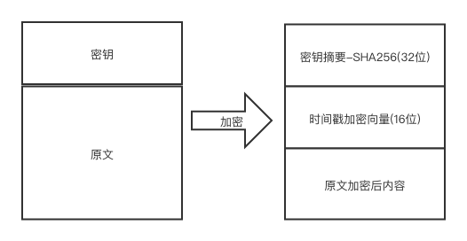
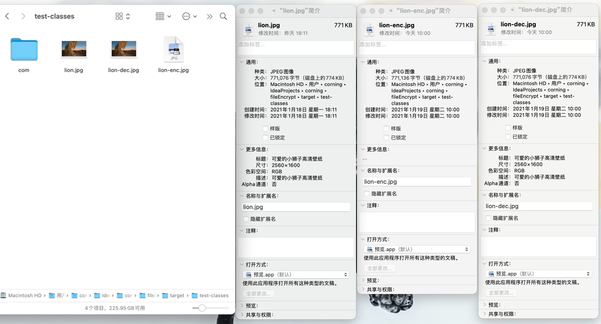

# Java 基于文件流的加解密实现

* 使用 `AES/CFB/PKCS5Padding` 算法
* 采用 `sha25` 摘要算法，验证加密密钥
* 采用16位长度加密密钥并用时间戳作为随机向量
* 除 JDK1.8 无任何其他依赖包

## 文件加密原理

* 解密者必须知道加密密钥
* 解密者必须知道解密算法



## 使用示例（JUNIT5 单元测试）

```java
package com.corning.crypto;

import org.junit.jupiter.api.BeforeEach;
import org.junit.jupiter.api.Test;

import java.io.File;
import java.io.FileInputStream;
import java.io.FileOutputStream;

class FileCryptoUtilTest {

    private String encKey;
    private File sourceFile;
    private File encFile;
    private File decFile;

    @BeforeEach
    void setUp() {
        // 加密KEY，长度不能小于16位
        encKey = "123456789qwertyui";
        System.out.println("encKey=" + encKey);

        // 测试跟目录
        String testRootPath = FileCryptoUtilTest.class.getResource("/").getFile();
        System.out.println("testRootPath=" + testRootPath);

        sourceFile = new File(testRootPath + "lion.jpg");
        if (!sourceFile.exists()) {
            throw new RuntimeException("fi not exist, path=" + sourceFile.getAbsolutePath());
        }
        System.out.println("sourceFile=" + sourceFile.getAbsolutePath());

        encFile = new File(testRootPath + "lion-enc.jpg");
        System.out.println("encFile=" + encFile.getAbsolutePath());
        if (encFile.exists()) {
            System.out.println("delete result=" + encFile.delete());
        }

        decFile = new File(testRootPath + "lion-dec.jpg");
        System.out.println("decFile=" + decFile.getAbsolutePath());
        if (decFile.exists()) {
            System.out.println("delete result=" + decFile.delete());
        }
    }

    @Test
    void encryptFile() throws Exception {
        // 加密
        try (FileInputStream fis = new FileInputStream(sourceFile);
             FileOutputStream fos = new FileOutputStream(encFile, true)) {
            FileCryptoUtil.encryptFile(fis, fos, encKey);
        }
        // 解密
        try (FileInputStream fis = new FileInputStream(encFile);
             FileOutputStream fos = new FileOutputStream(decFile, true)) {
            FileCryptoUtil.decryptedFile(fis, fos, encKey);
        }
    }
}
```

## 结果预览

